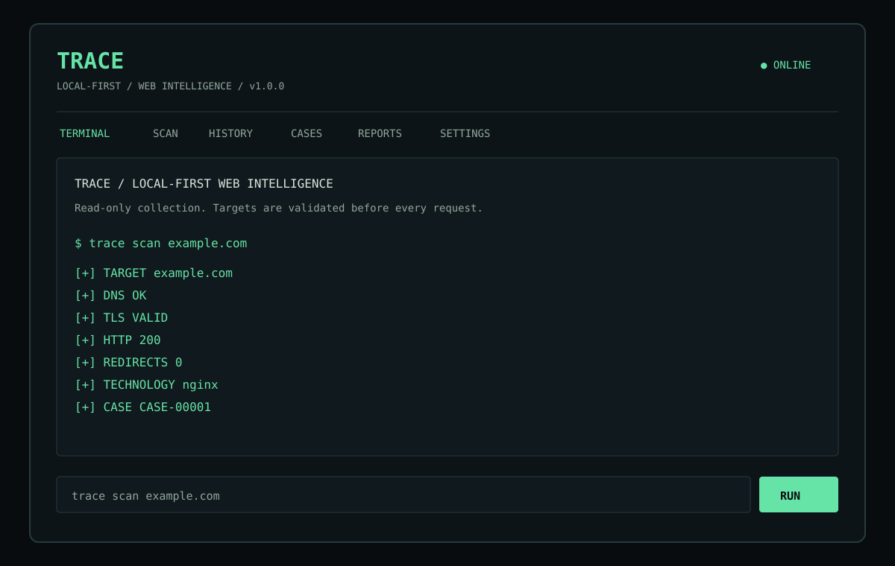

# TRACE

TRACE is a local-first Android web intelligence tool for authorized security research and defensive investigation. It provides a professional terminal-style interface for collecting **DNS, TLS, HTTP, redirect, header, technology, and optional reputation evidence** directly from the Android device's network connection.

> TRACE is read-only by design. It does not exploit, brute-force, attack credentials, flood services, bypass controls, or provide stealth/evasion features.

## Features

- Terminal commands that invoke real scanner functions
- HTTP/HTTPS URL normalization and status inspection
- Redirect chain collection with re-validation at every hop
- DNS-over-HTTPS lookups for A, AAAA, MX, NS, TXT, and CNAME records
- TLS certificate subject, issuer, validity, SAN count, and cipher details
- Security-header inspection
- Technology hints from response headers and HTML fingerprints
- Modular VirusTotal, URLhaus, and Google Safe Browsing provider support
- API keys entered through Settings and stored only in local Android app storage
- Local case history with `CASE-00001` identifiers
- JSON evidence and self-contained HTML report export
- Dark, minimal, monospace UI with no backend/server requirement

## Screenshots

### Terminal UI preview



The APK renders this same terminal-first visual language natively on Android.

## Installation

Download the APK from the [latest GitHub release](https://github.com/just-ulas/trace/releases/latest), enable installation from the browser or file manager when Android requests it, and install. No server, VPS, Docker, PostgreSQL, Redis, or nginx setup is required.

## Android APK

The repository includes a reproducible Gradle project. GitHub Actions builds the debug APK on pushes and pull requests and attaches a tagged APK to GitHub Releases.

Local build:

```bash
./gradlew testDebugUnitTest assembleDebug
```

Output:

```text
app/build/outputs/apk/debug/app-debug.apk
```

## Usage

Open TRACE and use the **TERMINAL** section:

```text
$ trace scan example.com

[+] TARGET        example.com
[+] DNS           OK
[+] TLS           VALID
[+] HTTP          200
[+] REDIRECTS     0
[+] TECHNOLOGY    nginx
[+] REPUTATION    3 provider modules
[+] CASE          CASE-00001
```

All network work is asynchronous so the interface remains responsive. The **SCAN** tab provides the same full scan as a form, while **HISTORY** and **CASES** reopen locally stored evidence.

## Terminal commands

| Command | Purpose |
| --- | --- |
| `trace scan <target>` | Full scan and save a local case |
| `trace dns <domain>` | A / AAAA / MX / NS / TXT / CNAME records |
| `trace tls <domain>` | Certificate and cipher information |
| `trace headers <url>` | Response and security headers |
| `trace redirects <url>` | Safe redirect chain |
| `trace tech <url>` | Web server, framework, CMS, and CDN hints |
| `trace reputation <domain>` | Provider module results |
| `trace history` | Local case list |
| `trace case <id>` | Reopen a case |
| `trace export <id>` | Write JSON and HTML reports |
| `trace clear` | Clear the terminal view |
| `trace help` | Show command help |

## Provider system

Provider integrations are modular and optional:

- **URLhaus** is queried without a key.
- **VirusTotal** accepts a user-supplied API key in Settings.
- **Google Safe Browsing** accepts a user-supplied API key in Settings.

Keys are never committed to source, written to cases, or included in GitHub Actions. If a provider is not configured or unavailable, the case records that provider's state without failing the core DNS/TLS/HTTP scan.

## Security

TRACE applies the following URL safety controls before every request:

- Only HTTP and HTTPS schemes are accepted.
- User-info URLs are rejected.
- `localhost`, `.local`, `.internal`, `.intranet`, `.lan`, and `home.arpa` names are blocked.
- Loopback, private, link-local, multicast, any-local, IPv4 special-range, and IPv6 ULA addresses are blocked.
- Every redirect target is normalized and validated again.
- Redirect chains stop after eight hops.
- Response bodies are capped at 256 KiB.
- Network operations have connect/read timeouts.

TRACE is intended for targets the operator is authorized to inspect.

## Architecture

```text
Android Activity
  ├── Terminal / Scan / History / Cases / Reports / Settings UI
  ├── TraceScanner
  │     ├── URL + SSRF validation
  │     ├── HTTP/redirect collector
  │     ├── DNS-over-HTTPS collector
  │     ├── TLS certificate collector
  │     ├── Technology detector
  │     └── Reputation provider modules
  └── CaseStore (SharedPreferences + app-private Documents export)
```

The base application has no continuously running backend and no required cloud service. Android's app storage provides persistence after restart; all analysis traffic originates from the device.

## Reports

Each export creates:

```text
case.json       case metadata plus results
evidence.json   scanner evidence bundle
report.html     standalone dark HTML report
```

Exports are written to the app-specific Documents directory, which does not require broad storage permission.

## License

TRACE is released under the MIT License. See [LICENSE](LICENSE).
